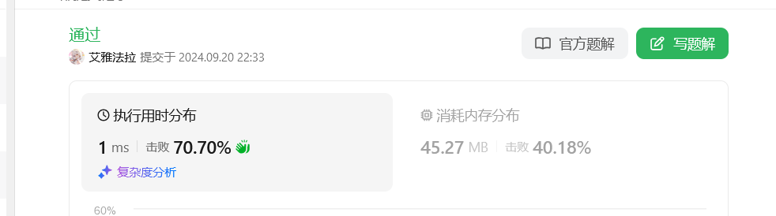
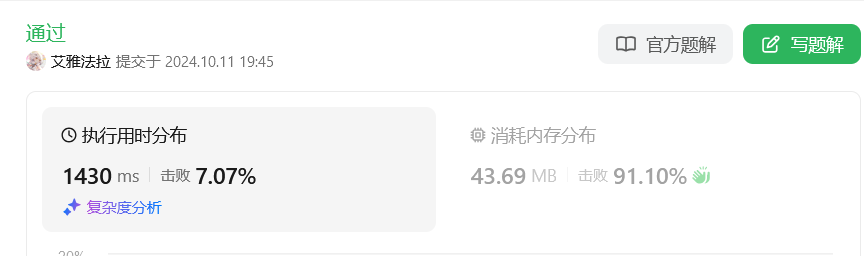
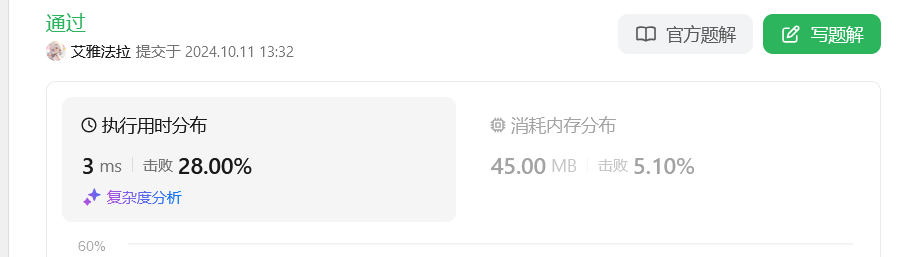
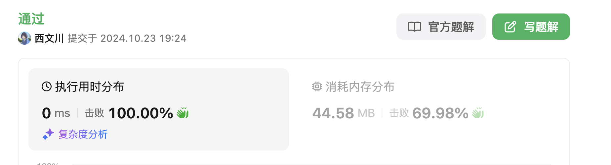

# 7.整数反转(mid)
## 题目描述
给你一个 32 位的有符号整数 x ，返回将 x 中的数字部分反转后的结果。

如果反转后整数超过 32 位的有符号整数的范围 [−231,  231 − 1] ，就返回 0。
## 分析
xxxxxxx
## 代码
```java
class Solution {
    public int reverse(int x) {

    }
}
```
## 运行截图


# 3.无重复字符的最长子串(mid)
## 题目描述
给定一个字符串 s ，请你找出其中不含有重复字符的 最长 子串的长度。
## 分析
滑动窗口，当遇到重复字符时不断移动左侧left，直到没有重复字符。每轮记录是否当前窗口大于最长字串长度。
## 代码
```java
class Solution {
    public int lengthOfLongestSubstring(String s) {
        int len=s.length();
        int[] map=new int[130];
        int left=0;
        int ans=0;
        for(int i=0;i<len;i++){
            map[s.charAt(i)]++;
            while(map[s.charAt(i)]>1){
                map[s.charAt(left)]--;
                left++;
            }
            ans=Math.max(ans,i-left+1);
        }
        return ans;
    }
}
```
## 运行截图


# 11.盛最多水的容器(mid)
## 题目描述
给定一个长度为 n 的整数数组 height 。有 n 条垂线，第 i 条线的两个端点是 (i, 0) 和 (i, height[i]) 。
找出其中的两条线，使得它们与 x 轴共同构成的容器可以容纳最多的水。
返回容器可以储存的最大水量。
## 分析
双指针，每次计算当前面积是否大于记录的，然后移动较小的边，贪心。
## 代码
```java
class Solution {
    public int maxArea(int[] height) {
        int n=height.length;
        int ans=0;
        int l=0,r=n-1;
        while(l<r){
            int cur=Math.min(height[l],height[r]);
            if(cur*(r-l)>ans){
                ans=cur*(r-l);
            }
            if(height[l]>height[r]){
                r--;
            }else{
                l++;
            }
        }
        return ans;
    }
}
```
## 运行截图


# 19.删除链表的倒数第 N 个结点(mid)
## 题目描述
给你一个链表，删除链表的倒数第 n 个结点，并且返回链表的头结点。
## 分析
双指针，一个指向头结点，一个指向倒数第n个结点，然后同时移动，直到后一个指针到达末尾。
## 代码
```java
/**
 * Definition for singly-linked list.
 * public class ListNode {
 *     int val;
 *     ListNode next;
 *     ListNode() {}
 *     ListNode(int val) { this.val = val; }
 *     ListNode(int val, ListNode next) { this.val = val; this.next = next; }
 * }
 */
class Solution {
    public ListNode removeNthFromEnd(ListNode head, int n) {
        // 双指针
        ListNode dummyNode = new ListNode(-1);
        dummyNode.next = head;
        ListNode pre = dummyNode;
        ListNode after = dummyNode;
        for(int i = 0; i < n; i++){
            after = after.next;
        }
        while(after.next != null){
            after = after.next;
            pre = pre.next;
        }
        pre.next = pre.next.next;
        return dummyNode.next;
    }
}
```
## 运行截图


# 20.有效的括号(easy)
## 题目描述
给定一个只包括 '('，')'，'{'，'}'，'['，']' 的字符串 s ，判断字符串是否有效。
## 分析
用栈遍历判断
## 代码
```java
class Solution {
    public boolean isValid(String s) {
        int n=s.length();
        if(n%2 == 1)return false;

        Stack<Character> sta = new Stack<>();
        for(char c : s.toCharArray()){
            if(c=='('){
                sta.push(')');
            }else if(c=='['){
                sta.push(']');
            }else if(c=='{'){
                sta.push('}');
            }else{
                if (sta.isEmpty() || sta.pop() != c) {
                    return false; // 栈为空或者匹配失败
                }
            } 
        }
        return sta.isEmpty();
    }
}
```
## 运行截图


# 21.合并两个有序链表(easy)
## 题目描述
将两个升序链表合并为一个新的 升序 链表并返回。新链表是通过拼接给定的两个链表的所有节点组成的。 
## 分析
迭代连接较小的节点，最后如果有剩余，直接接在后面。
## 代码
```java
class Solution {
    public ListNode mergeTwoLists(ListNode list1, ListNode list2) {
        ListNode head=new ListNode();
        ListNode memo=head;

        while(list1 !=null && list2 != null){
            if(list1.val < list2.val){
                head.next=list1;
                list1=list1.next;
            }else{
                head.next=list2;
                list2=list2.next;
            }
            head=head.next;
        }
        head.next = list1==null ? list2 : list1;
        return memo.next;
    }
}
```
## 运行截图


# 23.合并 K 个升序链表(hard)
## 题目描述
给你一个链表数组，每个链表都已经按升序排列。
请你将所有链表合并到一个升序链表中，返回合并后的链表。
## 分析
首先利用类似归并的思想，从步长为1开始将相邻的链表两两连到一起，merge函数是将两个子链表连到一起。
## 代码
```java
class Solution {
    public ListNode mergeKLists(ListNode[] lists) {
        int n=lists.length;
        if(n==0)return null;
        //类似归并
        for(int stride=1;stride<n;stride=stride*2){
            for(int i=0;i+stride<n;i+=stride*2){
                ListNode a=lists[i];
                ListNode b=lists[i+stride];
                lists[i]=merge(a,b);
            }
        }
        return lists[0];
    }
    public ListNode merge(ListNode head1,ListNode head2){
        ListNode head=new ListNode();
        ListNode memo=head;
        while(head1!=null&&head2!=null){
            if(head1.val<head2.val){
                head.next=head1;
                head1=head1.next;
            }else{
                head.next=head2;
                head2=head2.next;
            }
            head=head.next;
        }
        if(head1!=null){
            head.next=head1;
        }else{
            head.next=head2;
        }
        return memo.next;
    }
}
```
## 运行截图


# 24.两两交换链表中的节点(mid)
## 题目描述
给你一个链表，两两交换其中相邻的节点，并返回交换后链表的头节点。你必须在不修改节点内部的值的情况下完成本题（即，只能进行节点交换）。
## 分析
模拟这一过程，创建多个临时链表节点来模拟。
## 代码
```java
/**
 * Definition for singly-linked list.
 * public class ListNode {
 *     int val;
 *     ListNode next;
 *     ListNode() {}
 *     ListNode(int val) { this.val = val; }
 *     ListNode(int val, ListNode next) { this.val = val; this.next = next; }
 * }
 */
class Solution {
    public ListNode swapPairs(ListNode head) {
        if(head == null || head.next == null)return head;
        ListNode newHead = head.next;
        ListNode pre = null;
        ListNode cur1 = head;
        ListNode cur2;
        ListNode next;
        while(cur1 != null && cur1.next != null){
            // 交换 cur1 和 cur2
            cur2 = cur1.next;
            next = cur2.next;
            if(pre != null){
                pre.next = cur2;
            }
            cur2.next = cur1;
            cur1.next = next;
            pre = cur1;
            cur1 = cur1.next;
        }
        return newHead;
    }
}
```
## 运行截图


# 25.K 个一组翻转链表(hard)
## 题目描述
给你链表的头节点 head ，每 k 个节点一组进行翻转，请你返回修改后的链表。
k 是一个正整数，它的值小于或等于链表的长度。如果节点总数不是 k 的整数倍，那么请将最后剩余的节点保持原有顺序。
你不能只是单纯的改变节点内部的值，而是需要实际进行节点交换。
## 分析
模拟这一过程，创建多个临时链表节点来模拟。
## 代码
```java
class Solution {
    public ListNode reverseKGroup(ListNode head, int k) {
        //没有指针、->
        if(k==1)return head;
        ListNode vHead=new ListNode();
        vHead.next=null;
        ListNode h=vHead;
        while(head != null){
            ListNode p=head;
            ListNode first=p;
            ListNode q;
            int i=0;
            while(head != null && i<k){
                head=head.next;
                i++;
                //head移动
            }
            if(i<k){
                h.next=first;
                break;
            }
            for(int j=0;j<k;j++){
                q=p.next;
                p.next=h.next;
                h.next=p;
                p=q;
            }
            h=first;
        }
        return vHead.next;
    }
}
```
## 运行截图


# 27.移除元素(easy)
## 题目描述
给你一个数组 nums 和一个值 val，你需要**原地**移除所有数值等于 val 的元素，并返回移除后数组的新长度。
## 分析
双指针，一个指向当前位置，一个指向最后一个不等于val的位置。
## 代码
```java
class Solution {
    public int removeElement(int[] nums, int val) {
        int k = nums.length;
        int index = 0;
        int current = 0;
        for(int ele: nums){
            if(ele == val){
                k--;
            } else {
                nums[index] = nums[current];
                index++;
            }
            current++;
        }
        return k;
    }
}
```
## 运行截图


# 42.接雨水(hard)
## 题目描述
给定 n 个非负整数表示每个宽度为 1 的柱子的高度图，计算按此排列的柱子，下雨之后能接多少雨水。
## 分析
从左至右遍历一遍，存储遇到的最高值；再从右往左一遍。最后计算两边最高值的较小值与当前格子的值只差计入ans。
## 代码
```java
class Solution {
    public int trap(int[] height) {
        int n = height.length;
        int[] a=new int[n];
        for(int i=0;i<n;i++){
            a[i]=height[i];
        }
        int cur_high=0;
        for(int i=0;i<n;i++){//from left
            cur_high=Math.max(cur_high,height[i]);
            a[i]=cur_high;
        }
        cur_high=0;
        for(int i=n-1;i>=0;i--){//from right
            cur_high=Math.max(cur_high,height[i]);
            a[i]=Math.min(a[i],cur_high);
        }
        int ans=0;
        for(int i=0;i<n;i++){
            ans+=a[i]-height[i];
        }
        return ans;
    }
}
```
## 运行截图


# 46.全排列(mid)
## 题目描述
给定一个不含重复数字的数组 nums ，返回其 所有可能的全排列 。你可以 按任意顺序 返回答案。
## 分析
使用回溯法
## 代码
```java
class Solution {
    private List<List<Integer>> ans=new ArrayList<List<Integer>>();
    private List<Integer> path = new ArrayList<Integer>();
    public List<List<Integer>> permute(int[] nums) {
        int n=nums.length;
        if(n==0)return ans;
        boolean[] used=new boolean[n];
        dfs(nums,n,used);
        return ans;
    }

    public void dfs(int[] nums,int n,boolean[] used){
        if(path.size()==n){
            //ans.add(path); 添加的是path地址，而不是值
            ans.add(new ArrayList<>(path));
            return;
        }
        for(int i=0;i<n;i++){
            if(used[i]) continue;
            used[i]=true;
            path.add(nums[i]);
            dfs(nums,n,used);
            used[i]=false;
            path.remove(path.size()-1);
        }
    }
}
```
## 运行截图


# 51.N皇后(hard)
## 题目描述
给你一个整数 n ，返回所有不同的 n 皇后问题 的解决方案。
## 分析
使用回溯法，穷举可能。
## 代码
```java
class Solution {
    List<List<String>> ans= new ArrayList<List<String>>();
    public List<List<String>> solveNQueens(int n) {
        char[][] Queen=new char[n][n];
        for(int i=0;i<n;i++){
            for(int j=0;j<n;j++){
                Queen[i][j]='.';
            }
        }
        backtracking(Queen,0);
        return ans;
    }
    public void backtracking(char[][] Queen,int x){
        int n=Queen.length;
        if(x==n){
            List<String> cur=new ArrayList<String>();
            for(int i=0;i<n;i++){
                cur.add(new String(Queen[i]));
            }
            ans.add(cur);//
            return;
        }

        for(int j=0;j<n;j++){
            if(isValid(Queen,x,j)){
                Queen[x][j]='Q';
                backtracking(Queen,x+1);
                Queen[x][j]='.';
            }
        }
    }

    public boolean isValid(char[][] Queen,int x,int y){
        //上
        for(int i=x-1;i>=0;i--){
            if(Queen[i][y]=='Q'){
                return false;
            }
        }
        //左上
        for(int i=x,j=y;i>=0&&j>=0;i--,j--){
            if(Queen[i][j]=='Q'){
                return false;
            }
        }
        //右上
        for(int i=x,j=y;i>=0&&j<Queen.length;i--,j++){
            if(Queen[i][j]=='Q'){
                return false;
            }
        }
        return true;
    }
}
```
## 运行截图


# 59.螺旋矩阵II(mid)
## 题目描述
给定一个正整数 n，生成一个包含 1 到 n^2 所有元素，且元素按顺时针顺序螺旋排列的 n x n 正方形矩阵。
## 分析
模拟，按照顺时针的方向填入数字。
## 代码
```java
class Solution {
    public int[][] generateMatrix(int n) {
        int[][] arr = new int[n][n];
        int layer = 0;
        int current = 1;
        while(layer <= n/2){
            for(int i = layer; i < n-layer; i++){
                arr[layer][i] = current;
                current++;
            };
            for(int i = layer+1; i < n-layer; i++){
                arr[i][n-layer-1] = current;
                current++;
            };
            for(int i = n-layer-2; i >= layer; i--){
                arr[n-layer-1][i] = current;
                current++;
            };
            for(int i = n-layer-2; i >= layer+1; i--){
                arr[i][layer] = current;
                current++;
            };
            layer++;
        }
        return arr;
    }
}
```
## 运行截图


# 65.有效数字(hard)
## 题目描述
给定一个字符串 s ，返回 s 是否是一个 有效数字。
## 分析
模拟，编写代码逐个判断
## 代码
```java
class Solution {
    public boolean isNumber(String s) {
        int n = s.length();
        char[] cs = s.toCharArray();
        int idx = -1;
        for (int i = 0; i < n; i++) {
            if (cs[i] == 'e' || cs[i] == 'E') {
                if (idx == -1) idx = i;
                else return false;
            }
        }
        boolean ans = true;
        if (idx != -1) {
            ans &= check(cs, 0, idx - 1, false);
            ans &= check(cs, idx + 1, n - 1, true);
        } else {
            ans &= check(cs, 0, n - 1, false);
        }
        return ans;
    }
    boolean check(char[] cs, int start, int end, boolean mustInteger) {
        if (start > end) return false;
        if (cs[start] == '+' || cs[start] == '-') start++;
        boolean hasDot = false, hasNum = false;
        for (int i = start; i <= end; i++) {
            if (cs[i] == '.') {
                if (mustInteger || hasDot) return false;
                hasDot = true;
            } else if (cs[i] >= '0' && cs[i] <= '9') {
                hasNum = true;
            } else {
                return false;
            }
        }
        return hasNum;
    }
}
```
## 运行截图


# 76.最小覆盖子串(hard)
## 题目描述
给你一个字符串 s 、一个字符串 t 。返回 s 中涵盖 t 所有字符的最小子串。如果 s 中不存在涵盖 t 所有字符的子串，则返回空字符串 "" 。
## 分析
定义两个哈希表，分别存储模式串和当前窗口，遍历匹配串，使用滑动窗口，统计diff数值，当diff=0时说明窗口符合要求，此时窗口左侧左移来求得最小值
## 代码
```java
class Solution {
    int ans=Integer.MAX_VALUE;
    int ansStart=0;
    public String minWindow(String s, String t) {
        int n=s.length(),m=t.length();
        if(m>n)return "";
        Map<Character, Integer> mp = new HashMap<Character, Integer>();//模式串
        Map<Character, Integer> mp2 = new HashMap<Character, Integer>();//当前窗口
        int differ=m;
        for(int i=0;i<m;i++){
            mp.put(t.charAt(i), mp.getOrDefault(t.charAt(i), 0) + 1);
            //mp[t[i]]++;
        }
        int left=0;
        for(int i=0;i<n;i++){
            while(differ==0){
                setAnswer(i-left,left);
                //mp.find(s[left])!=mp.end()
                if(mp.get(s.charAt(left)) != null){
                    differ++;
                    mp2.put(s.charAt(left), mp2.getOrDefault(s.charAt(left), 0) - 1);
                    //mp2[s[left]]--;
                    
                    if(mp2.getOrDefault(s.charAt(left),0)>=mp.getOrDefault(s.charAt(left),0))differ--;
                
                }left++;
            }

            if(mp.get(s.charAt(i)) != null){//find it
                differ--;
                mp2.put(s.charAt(i), mp2.getOrDefault(s.charAt(i), 0) + 1);
                //mp2[s[i]]++;
                
                if(mp2.getOrDefault(s.charAt(i),0)>mp.getOrDefault(s.charAt(i),0))differ++;
            }

            if(differ==0){
                setAnswer(i-left+1,left);
            }
        }
        while(differ==0){
            setAnswer(n-left,left);
            if(mp.get(s.charAt(left)) != null){
                differ++;
                mp2.put(s.charAt(left), mp2.getOrDefault(s.charAt(left), 0) - 1);
                if(mp2.getOrDefault(s.charAt(left),0)>=mp.getOrDefault(s.charAt(left),0))differ--;
            
            }left++;
        }
        return ans==Integer.MAX_VALUE ? "" : s.substring(ansStart,ansStart+ans);
    }
    public void setAnswer(int len,int start){
        if(this.ans>len){
            this.ans=len;
            this.ansStart=start;
        }
    }
}
```
## 运行截图


# 84. 柱状图中最大的矩形(hard)
## 题目描述
给定 n 个非负整数，用来表示柱状图中各个柱子的高度。每个柱子彼此相邻，且宽度为 1 。
求在该柱状图中，能够勾勒出来的矩形的最大面积。
## 分析
利用单调栈，找出每个格子右侧第一个小于他的下表，记录下来。左侧一样。最后求结果。
## 代码
```java
class Solution {
    public int largestRectangleArea(int[] heights) {
        int n=heights.length;
        Stack<Integer> stk1 = new Stack<>();
        int[] vec1 = new int[n];
        Arrays.fill(vec1,n);//无穷远在第n位
        for(int i=0;i<n;i++){
            while(!stk1.isEmpty()&&heights[stk1.peek()]>heights[i]){
                vec1[stk1.pop()]=i;
            }
            stk1.push(i);
        }
        Stack<Integer> stk2 = new Stack<>();
        int[] vec2 = new int[n];
        Arrays.fill(vec2,-1);
        for(int i=n-1;i>=0;i--){
            while(!stk2.isEmpty()&&heights[stk2.peek()]>heights[i]){
                vec2[stk2.pop()]=i;
            }
            stk2.push(i);
        }
        int ans=0;
        for(int i=0;i<n;i++){
            int now=((vec1[i]-1) - (vec2[i]+1) +1)*heights[i];
            ans=Math.max(ans,now);
        }
        return ans;
    }
}
```
## 运行截图


# 101. 对称二叉树(easy)
## 题目描述
给你一个二叉树的根节点 root ， 检查它是否轴对称。
## 分析
判断是否镜像对称，首先判断它们的两个根结点具有相同的值，其次判断每个树的右子树都与另一个树的左子树镜像对称。递归求解。
## 代码
```java
class Solution {
    public boolean isSymmetric(TreeNode root) {
        if(root == null)return true;
        return func(root.left,root.right);
    }
    public boolean func(TreeNode left, TreeNode right){
        if(left==null && right == null)return true;
        if(left==null || right==null)return false;
        if(left.val != right.val)return false;
        return func(left.left,right.right) && func(left.right,right.left);
    }
}
```
## 运行截图


# 115. 不同的子序列(hard)
## 题目描述
给你两个字符串 s 和 t ，统计并返回在 s 的 子序列 中 t 出现的个数，结果需要对 109 + 7 取模。
## 分析
二维动态规划，如果s[i]==t[j],可以选s[i]也可以不选。
## 代码
```java
class Solution {
    public int numDistinct(String s, String t) {
        int n1=s.length(),n2=t.length();
        int mod=1000000007;
        int[][] dp= new int[n1+1][n2+1];
        for(int i=0;i<=n1;i++){
            dp[i][0]=1;
        }
        for(int i=0;i<n1;i++){
            for(int j=0;j<n2;j++){
                 if(s.charAt(i)==t.charAt(j)){
                     dp[i+1][j+1]=(dp[i][j]+dp[i][j+1])%mod;
                     //dp[i][j+1] 不考虑s中这个字符
                 }else{
                     dp[i+1][j+1]=dp[i][j+1];
                 }
            }
        }
        return dp[n1][n2];
    }
}
```
## 运行截图


# 121. 买卖股票的最佳时机(easy)
## 题目描述
给定一个数组 prices ，它的第 i 个元素 prices[i] 表示一支给定股票第 i 天的价格。
你只能选择 某一天 买入这只股票，并选择在 未来的某一个不同的日子 卖出该股票。设计一个算法来计算你所能获取的最大利润。
返回你可以从这笔交易中获取的最大利润。如果你不能获取任何利润，返回 0 。
## 分析
记录遇到的最低值，遍历数组，每次计算当前与最低值的差。
## 代码
```java
class Solution {
    public int maxProfit(int[] prices) {
        int cost=Integer.MAX_VALUE;
        int ans=0;
        for(int i=0;i<prices.length;i++){
            if(cost>prices[i]){
                cost=prices[i];
            }
            ans=Math.max(ans,prices[i]-cost);
        }
        return ans;
    }
}
```
## 运行截图


# 122. 买卖股票的最佳时机II(mid)
## 题目描述
给你一个整数数组 prices ，其中 prices[i] 表示某支股票第 i 天的价格。
在每一天，你可以决定是否购买和/或出售股票。你在任何时候 最多 只能持有 一股 股票。你也可以先购买，然后在 同一天 出售。
返回 你能获得的 最大 利润 。
## 分析
动态规划，每天的状态分为持有和不持有股票，遍历，最后答案便是最后一天不持有股票。
## 代码
```java
class Solution {
    public int maxProfit(int[] prices) {
        int n=prices.length;
        int[][] dp=new int[n][2];
        //0 for 不持有；1 for 持有
        dp[0][0]=0;
        dp[0][1]=-prices[0];
        for(int i=1;i<n;i++){
            dp[i][0]=Math.max(dp[i-1][0],dp[i-1][1]+prices[i]);
            dp[i][1]=Math.max(dp[i-1][0]-prices[i],dp[i-1][1]);
        }
        return dp[n-1][0];
    }
}
```
## 运行截图


# 123. 买卖股票的最佳时机III(hard)
## 题目描述
给定一个数组，它的第 i 个元素是一支给定的股票在第 i 天的价格。
设计一个算法来计算你所能获取的最大利润。你最多可以完成 两笔 交易。
注意：你不能同时参与多笔交易（你必须在再次购买前出售掉之前的股票）。
## 分析
动态规划，每天的状态分为1第一次持有 2第一次不持有 3第二次持有 4第二次不持有,遍历数组更新。
## 代码
```java
class Solution {
    public int maxProfit(int[] prices) {
        int n=prices.length;
        int[][] dp=new int[n][5];
        //0不操作(可省略) 1第一次持有 2第一次不持有 3第二次持有 4第二次不持有
        dp[0][0]=dp[0][2]=dp[0][4]=0;
        dp[0][1]=dp[0][3]=-prices[0];

        for(int i=1;i<n;i++){
            //dp[i][0]=dp[i-1][0];
            dp[i][1]=Math.max(dp[i-1][1],0-prices[i]);
            dp[i][2]=Math.max(dp[i-1][2],dp[i-1][1]+prices[i]);
            dp[i][3]=Math.max(dp[i-1][3],dp[i-1][2]-prices[i]);
            dp[i][4]=Math.max(dp[i-1][4],dp[i-1][3]+prices[i]);

        }
        return dp[n-1][4];
    }
}
```
## 运行截图


# 124. 二叉树中的最大路径和(hard)
## 题目描述
二叉树中的 路径 被定义为一条节点序列，序列中每对相邻节点之间都存在一条边。同一个节点在一条路径序列中 至多出现一次 。该路径 至少包含一个 节点，且不一定经过根节点。路径和 是路径中各节点值的总和。
给你一个二叉树的根节点 root ，返回其 最大路径和 。
## 分析
递归，找到每一个节点的左右最大路径和。
## 代码
```java
class Solution {
    private int ans=Integer.MIN_VALUE;
    public int maxPathSum(TreeNode root) {
        func(root);
        return ans;
    }
    public int func(TreeNode root){
        if(root==null)return 0;
        int left=Math.max(func(root.left),0);
        int right=Math.max(func(root.right),0);
        ans=Math.max(ans,root.val+left+right);
        return root.val+Math.max(left,right);
    }
}
```
## 运行截图


# 127. 单词接龙(hard)
## 题目描述
给你两个单词 beginWord 和 endWord 和一个字典 wordList ，返回 从 beginWord 到 endWord 的 最短转换序列 中的 单词数目 。如果不存在这样的转换序列，返回 0 。
## 分析
广度优先搜索，建立图的模型。
## 代码
```java
class Solution {
    public int ladderLength(String beginWord, String endWord, List<String> wordList) {
        int n=wordList.size();
        int count=1;
        //mp 存路径前一个单词
        Set<String> visited = new HashSet<>();
        //Map<String,String> mp = new HashMap<String,String>();
        Queue<String> q= new LinkedList<String>();
        q.offer(beginWord);
        //mp.put(beginWord,beginWord);
        visited.add(beginWord);
        while(!q.isEmpty()){
            int m=q.size();
            for(int k=0;k<m;k++){
                String now=q.poll();
                if(now.equals(endWord)){
                    return count;
                }
                for(int i=0;i<n;i++){
                    String curStr=wordList.get(i);
                    if(isDiffer(now,curStr) && !visited.contains(curStr)){
                        visited.add(curStr);
                        q.offer(curStr);
                    }
                }
            }
            count++;
        }
        return 0;
    }
    public boolean isDiffer(String a,String b){
        int ans=0;
        for(int i=0;i<a.length();i++){
            if(a.charAt(i)!=b.charAt(i))ans++;
        }
        return ans==1;
    }
}
```
## 运行截图


# 135. 分发糖果(hard)
## 题目描述
n 个孩子站成一排。给你一个整数数组 ratings 表示每个孩子的评分。
你需要按照以下要求，给这些孩子分发糖果：
    每个孩子至少分配到 1 个糖果。
    相邻两个孩子评分更高的孩子会获得更多的糖果。
请你给每个孩子分发糖果，计算并返回需要准备的 最少糖果数目 。
## 分析
贪心算法，左右各跑一趟，如果当前孩子比前一个大，分到的糖是前一个的+1
## 代码
```java
class Solution {
    public int candy(int[] ratings) {
        int n=ratings.length;
        int[] ans=new int[n];
        Arrays.fill(ans,1);
        for(int i=1;i<n;i++){
            if(ratings[i]>ratings[i-1]){
                ans[i]=ans[i-1]+1;
            }
            
        }
        for(int i=n-2;i>=0;i--){
            if(ratings[i]>ratings[i+1]){
                ans[i]=Math.max(ans[i],ans[i+1]+1);
            }
        }
        int sum=0;
        for(int i=0;i<n;i++){
            sum+=ans[i];
        }
        return sum;
    }
}
```
## 运行截图


# 141. 环形链表(easy)
## 题目描述
给你一个链表的头节点 head ，判断链表中是否有环。
## 分析
使用快慢指针
## 代码
```java
public class Solution {
    public boolean hasCycle(ListNode head) {
        if(head==null)return false;
        ListNode fast,slow=head;
        fast=slow.next;
        while(fast!=slow){
            slow=slow.next;
            if(fast != null){
                fast=fast.next;
            }
            if(fast != null){
                fast=fast.next;
            }
        }
        return slow!=null;
    }
}
```
## 运行截图


# 154. 寻找旋转排序数组中的最小值 II(hard)
## 题目描述
已知一个长度为 n 的数组，预先按照升序排列，经由 1 到 n 次 旋转 后，得到输入数组。例如，原数组 nums = [0,1,4,4,5,6,7] 在变化后可能得到：
给你一个可能存在 重复 元素值的数组 nums ，它原来是一个升序排列的数组，并按上述情形进行了多次旋转。请你找出并返回数组中的 最小元素 。
你必须尽可能减少整个过程的操作步骤。
## 分析
二分查找，对比mid和right，注意相等时选择right--以避免错过答案
## 代码
```java
class Solution {
    public int findMin(int[] nums) {
        int n=nums.length;
        int left=0,right=n-1;
        while(left<right){
            int mid=(left+right)>>1;
            if(nums[mid]<nums[right]){//等于的时候不可以这样缩小
                right=mid;//不能mid-1，因为mid有可能是答案
            }else if(nums[mid]>nums[right]){
                left=mid+1;
            }else{
                right--;//无法找到，那就先缩后(因为比的是后半)
            }
        }
        return nums[left];
    }
}
```
## 运行截图


# 160. 相交链表(easy)
## 题目描述
编写一个程序，找到两个单链表相交的起始节点。
## 分析
双指针，一个指向A链表，一个指向B链表，当一个指针到达末尾时，指向另一个链表的头，最后相遇的地方即为相交点。
## 代码
```java
/**
 * Definition for singly-linked list.
 * public class ListNode {
 *     int val;
 *     ListNode next;
 *     ListNode(int x) {
 *         val = x;
 *         next = null;
 *     }
 * }
 */
public class Solution {
    public ListNode getIntersectionNode(ListNode headA, ListNode headB) {
        int len_A = 0;
        int len_B = 0;
        ListNode current_A = headA;
        ListNode current_B = headB;
        while(current_A != null){
            current_A = current_A.next;
            len_A++;
        }
        while(current_B != null){
            current_B = current_B.next;
            len_B++;
        }
        current_A = headA;
        current_B = headB;
        int distance = len_A - len_B;
        if(distance < 0){
            for(int i = 0; i < -distance; i++){
                current_B = current_B.next;
            }
        } else {
            for(int i = 0; i < distance; i++){
                current_A = current_A.next;
            }
        }
        while(current_A != current_B){
            current_A = current_A.next;
            current_B = current_B.next;
        }
        return current_A;
    }
}
```
## 运行截图


# 188. 买卖股票的最佳时机 IV(hard)
## 题目描述
给你一个整数数组 prices 和一个整数 k ，其中 prices[i] 是某支给定的股票在第 i 天的价格。
设计一个算法来计算你所能获取的最大利润。你最多可以完成 k 笔交易。也就是说，你最多可以买 k 次，卖 k 次。
## 分析
一共k次，定义n*（2k+1）的数组，分别表示k次持有、不持有，类似III的解法。
## 代码
```java
class Solution {
    public int maxProfit(int k, int[] prices) {
        //最多k次
        int n=prices.length;
        int[][] dp=new int[n][2*k+1];
        for(int i=0;i<k;i++){
            dp[0][2*i+1]=-prices[0];
        }
        for(int i=1;i<n;i++){
            for(int j=0;j<k;j++){
                dp[i][2*j+1]=Math.max(dp[i-1][2*j+1],dp[i-1][2*j]-prices[i]);
                dp[i][2*j+2]=Math.max(dp[i-1][2*j+2],dp[i-1][2*j+1]+prices[i]);
            }
        }
        return dp[n-1][2*k];
    }
}
```
## 运行截图


# 203.移除链表元素(easy)
## 题目描述
给你一个链表的头节点 head 和一个整数 val ，请你删除链表中所有满足 Node.val == val 的节点，并返回新的头节点 。
## 分析
处理头节点为要移除的值的情况，再遍历列表，使用头插法删除节点。
## 代码
```java
/**
 * Definition for singly-linked list.
 * public class ListNode {
 *     int val;
 *     ListNode next;
 *     ListNode() {}
 *     ListNode(int val) { this.val = val; }
 *     ListNode(int val, ListNode next) { this.val = val; this.next = next; }
 * }
 */
class Solution {
    public ListNode removeElements(ListNode head, int val) {
        while(head != null && head.val == val){
            head = head.next;
        }
        ListNode current = head;
        while(current != null){
            if(current.next != null && current.next.val == val){
                current.next = current.next.next;
            } else {
                current = current.next; 
            }
        }
        return head;
    }
}
```
## 运行截图


# 206.反转链表(easy)
## 题目描述
给你单链表的头节点 head ，请你反转链表，并返回反转后的链表。 
## 分析
头插法
## 代码
```java
class Solution {
    public ListNode reverseList(ListNode head) {
        ListNode pre=null,p;
        while(head != null){
            p=head.next;
            head.next=pre;
            pre=head;
            head=p;
        }
        return pre;
    }
}
```
## 运行截图


# 208. 实现 Trie (前缀树)(mid)
## 题目描述
请你实现 Trie 类：
    Trie() 初始化前缀树对象。
    void insert(String word) 向前缀树中插入字符串 word 。
    boolean search(String word) 如果字符串 word 在前缀树中，返回 true（即，在检索之前已经插入）；否则，返回 false 。
    boolean startsWith(String prefix) 如果之前已经插入的字符串 word 的前缀之一为 prefix ，返回 true ；否则，返回 false 。
## 分析
根据字典树的定义逐步实现每个方法。注意search和startwith都调用的searchPrefix函数
## 代码
```java
class Trie {
    private Trie[] children;
    private boolean isEnd;
    public Trie() {
        children = new Trie[26];
        isEnd = false;
    }
    
    public void insert(String word) {
        Trie node=this;
        for (int i = 0; i < word.length(); i++) {
            char ch= word.charAt(i);
            int index=ch-'a';
            if(node.children[index]==null){
                node.children[index]=new Trie();
            }
            node=node.children[index];
        }
        node.isEnd=true;
    }
    
    public boolean search(String word) {
        Trie node = searchPrefix(word);
        return node != null && node.isEnd;
    }

    public boolean startsWith(String prefix) {
        return searchPrefix(prefix) != null;
    }

    private Trie searchPrefix(String prefix) {
        Trie node = this;
        for (int i = 0; i < prefix.length(); i++) {
            char ch= prefix.charAt(i);
            int index=ch-'a';
            if(node.children[index]==null)return null;
            node=node.children[index];
        }
        return node;
    }
}
```
## 运行截图


# 233. 数字 1 的个数(hard)
## 题目描述
给定一个整数 n，计算所有小于等于 n 的非负整数中数字 1 出现的个数。
## 分析
枚举每一数位上 1 的个数
## 代码
```java
class Solution {
public:
    int countDigitOne(int n) {
        long long mulk=1;
        int ans=0;
        for(int k=0;n>=mulk;k++){
            int rest=n % (mulk * 10);
            ans+= (n/(mulk*10))*mulk + fmin(mulk,fmax(0,rest-mulk+1));
            mulk*=10;
        }
        return ans;
    }
}
```
## 运行截图


# 239.滑动窗口最大值(hard)
## 题目描述
给你一个整数数组 nums，有一个大小为 k 的滑动窗口从数组的最左侧移动到数组的最右侧。你只可以看到在滑动窗口内的 k 个数字。滑动窗口每次只向右移动一位。返回 滑动窗口中的最大值 。
## 分析
使用双端队列，存储一个单调递减的数，遍历数组，如果大于队尾则遍历弹出队尾。每次队尾的值就是所求。
## 代码
```java
class Solution {
    public int[] maxSlidingWindow(int[] nums, int k) {
        int n=nums.length;
        Deque<Integer> deque=new LinkedList<Integer>();
        for(int i=0;i<k;i++){
            while(!deque.isEmpty() && nums[i]>=nums[deque.peekLast()]){
                deque.pollLast();
            }
            deque.offerLast(i);
        }
        int[] ans=new int[n-k+1];
        ans[0]=nums[deque.peekFirst()];
        for(int i=k;i<n;i++){
            while (!deque.isEmpty() && nums[i] >= nums[deque.peekLast()]) {
                deque.pollLast();
            }
            deque.offerLast(i);
            if(deque.peekFirst()<=i-k){
                deque.pollFirst();//滑出窗口左侧
            }
            ans[i-k+1]=nums[deque.peekFirst()];
        }
        return ans;
    }
}
```
## 运行截图


# 283.移动零(easy)
## 题目描述
给定一个数组 nums，编写一个函数将所有 0 移动到数组的末尾，同时保持非零元素的相对顺序。
请注意 ，必须在不复制数组的情况下原地对数组进行操作。
## 分析
遍历一遍即可，将遇到的非零数字依次填写，最后把index后面的位置补0
## 代码
```java
class Solution {
    public void moveZeroes(int[] nums) {
        int n=nums.length;
        int index=0;
        for(int i=0;i<n;i++){
            if(nums[i]!=0){//把非0的移到顶
                int temp=nums[i];
                nums[i]=nums[index];
                nums[index]=temp;
                index++;
            }
        }
        for(;index<n;index++){
            nums[index]=0;
        }
    }
}
```
## 运行截图


# 560.和为 K 的子数组(mid)
## 题目描述
给你一个整数数组 nums 和一个整数 k ，请你统计并返回 该数组中和为 k 的子数组的个数 。
## 分析
利用哈希表存储遇到的前缀和，如果当前前缀和减去k的结果在map中出现过，则这之间的数字之和为k，加入答案中。不断更新前缀和并加入哈希表。
## 代码
```java
class Solution {
    public int subarraySum(int[] nums, int k) {
        int n=nums.length;
        int ans=0;
        int pre=0;
        HashMap<Integer,Integer> mp=new HashMap<>();
        mp.put(0,1);
        for(int i=0;i<n;i++){
            pre+=nums[i];
            if(mp.containsKey(pre-k)){
                ans+=mp.get(pre-k);
            }
            mp.put(pre,mp.getOrDefault(pre,0)+1);//getOrDefault
        }
        return ans;
    }
}
```
## 运行截图


# 704.二分查找(easy)
## 题目描述
给定一个 n 个元素有序的（升序）整型数组 nums 和一个目标值 target  ，写一个函数搜索 nums 中的 target，如果目标值存在返回下标，否则返回 -1。
## 分析
比较 target 与数组中间的值，如果相等则返回，如果小于中间值则将右半部分裁切留下左半部分，反之亦然，然后重复上述过程。如果最后数组为空则返回-1。
## 代码
```java
class Solution {
    public int search(int[] nums, int target) {
        int low = 0;
        int high = nums.length;
        int mid;
        while(low <= high){
            mid = (low + high)/2;
            if(nums[mid] == target){
                return mid;
            } else if (nums[mid] < target){
                low = mid + 1;
            } else {
                high = mid - 1;
            }
        }
        return -1;
    }
}
```
## 运行截图


# 977.有序数组的平方(easy)
## 题目描述
给你一个按 非递减顺序 排序的整数数组 nums，返回每个数字的平方组成的新数组，要求也按 非递减顺序 排序。
## 分析
双指针，分别指向数组的两端，比较两端的平方值，将较大的放入结果数组的末尾。
## 代码
```java
class Solution {
    public int[] sortedSquares(int[] nums) {
        int[] newArr = new int[nums.length];
        int low = 0;
        int high = nums.length - 1;
        int current = nums.length - 1;
        int highSqr = -1;
        int lowSqr = -1;
        while(high >= low){
            highSqr = (highSqr < 0) ? (int)Math.pow(nums[high], 2) : highSqr; // 避免重复计算
            lowSqr = (lowSqr < 0) ? (int)Math.pow(nums[low], 2) : lowSqr; // 同上
            if(highSqr >= lowSqr){
                newArr[current] = highSqr;
                highSqr = -1;
                high--;
            } else {
                newArr[current] = lowSqr;
                lowSqr = -1;
                low++;
            }
            current--;
        }
        return newArr;
    }
}
```
## 运行截图


# 994.腐烂的橘子(mid)
## 题目描述
在给定的 m x n 网格 grid 中，每个单元格可以有以下三个值之一：
    值 0 代表空单元格；
    值 1 代表新鲜橘子；
    值 2 代表腐烂的橘子。
每分钟，腐烂的橘子 周围 4 个方向上相邻 的新鲜橘子都会腐烂。
返回 直到单元格中没有新鲜橘子为止所必须经过的最小分钟数。如果不可能，返回 -1 。
## 分析
BFS，将腐烂的橘子存入队列，每次取一个，污染周围再加入队列，直到队列为空。记录轮次，返回时间。
## 代码
```java
class Solution {
    public int orangesRotting(int[][] grid) {
        int[][] dir=new int[][]{{1,0},{-1,0},{0,1},{0,-1}};
        int m=grid.length,n=grid[0].length;
        int nums=0,cnt=0;
        int time=0;
        Queue<int[]> q = new LinkedList<>();
        for(int i=0;i<m;i++){
            for(int j=0;j<n;j++){
                if(grid[i][j]==1){
                    nums++;
                }else if(grid[i][j]==2){
                    q.add(new int[]{i,j});
                }
            }
        }
        while(!q.isEmpty()){
            int size=q.size();
            for(int k=0;k<size;k++){
                int[] orange=q.poll();
                int x=orange[0];
                int y=orange[1];
                for(int i=0;i<4;i++){
                    int xx=x+dir[i][0],yy=y+dir[i][1];
                    if(xx>=m||xx<0||yy<0||yy>=n)continue;
                    if(grid[xx][yy]==1){
                        q.add(new int[]{xx,yy});
                        cnt++;
                        grid[xx][yy]=2;
                    }
                }
            }
            if(!q.isEmpty())time++;
        }
        if(cnt==nums){
            return time;
        }else return -1;
    }
}
```
## 运行截图

